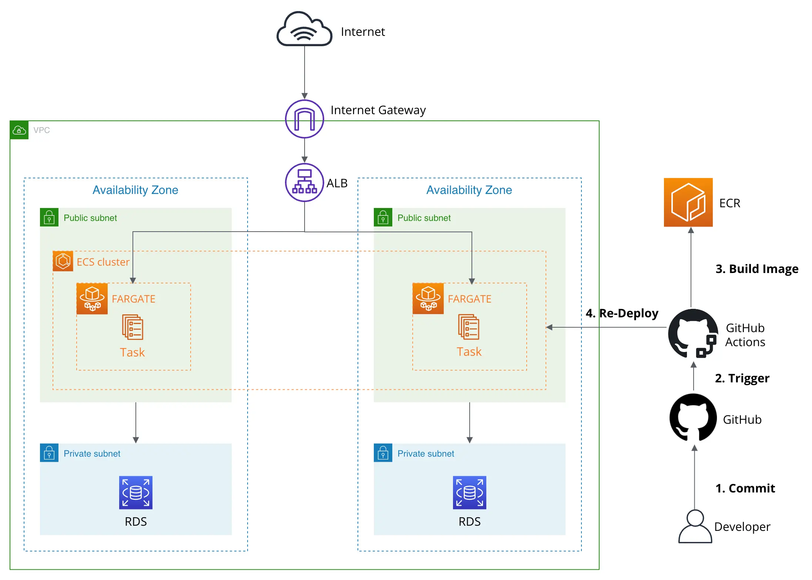
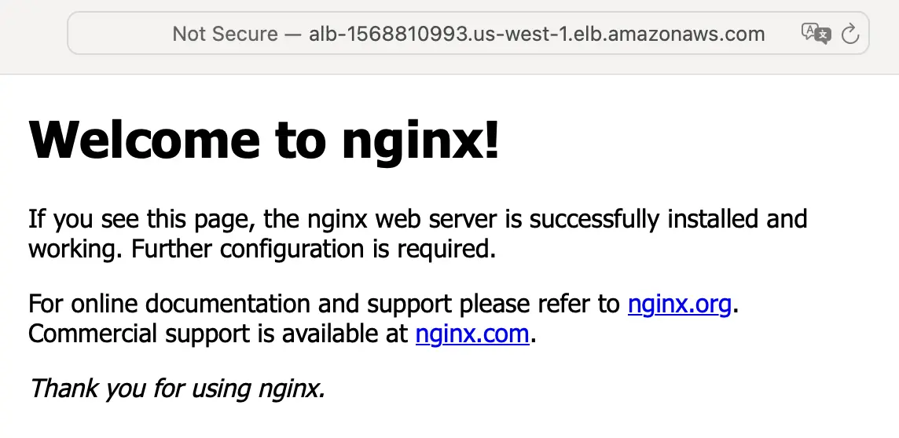
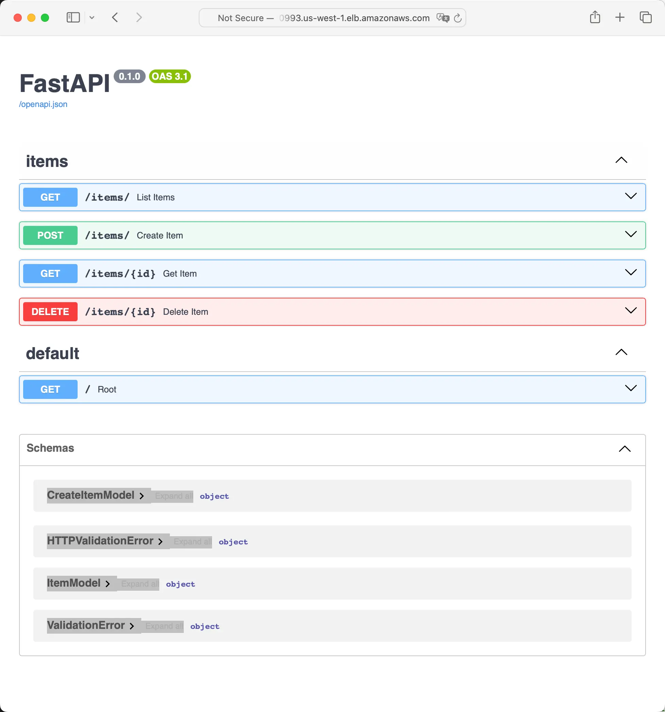
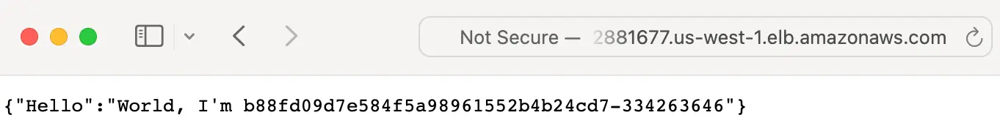
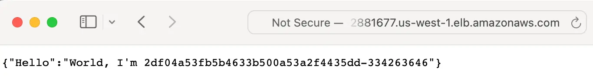

# AWS ECS Demo with CI/CD Pipeline by GitHub Actions

## Introduction

- This repository is a demo to deploy applications on AWS using Terraform with CI/CD pipeline from GitHub Actions to trigger re-deploy.

### Architecture

- We spin up the application in containers via AWS Elastic Container Service (ECS) in FARGATE (Serverless EC2)
- Images are stored in Elastic Container Registry (ECR) providing to FARGATE if needed
- A PostgresSQL database is deployed using Relational Database Service (RDS), which is put in private subnets

<p align="center">
  
  <br/>
  <b>Demo Architecture</b>
</p>

### Client Routes

- Requests first go to Internet Gateway (IGW) and route to Application Load Balancer (ALB) by route table config
- ALB forward requests to Target Groups which links to application ports in FARGATE
- Only applications (security group) can connect to RDS if needed

### Developer Routes

- Code changes in applications commit to GitHub repository
- GitHub Actions (CI/CD pipeline) get triggered
  - **CI**: build images and send to private ECR (similar to Docker Hub)
  - **CD**: prepare new `task definition` (config to run a container) and send to ECS, and then ask ECS to re-deploy containers

## How to Run

### Prerequisites

- [Terraform](https://www.terraform.io/)
- [GitHub CLI](https://cli.github.com/)
- Fork the repo under your GitHub account since we need repo variables to run GitHub Actions

### Setup AWS Config

```bash
# Terraform AWS access
export AWS_ACCESS_KEY_ID="<YOUR_KEY>"
export AWS_SECRET_ACCESS_KEY="<YOUR_SECRET>"
```

### Apply AWS Config

- Apply Terraform

```bash
cd terraform

# Terraform Variables
cp terraform.tfvars.example terraform.tfvars
# Replace "GITHUB_ACCOUNT" to your actual github account
sed -i '' -e 's/<USERNAME>/GITHUB_ACCOUNT/g' terraform.tfvars

# Apply Terraform Config for AWS
terraform init
terraform apply --auto-approve
```

- When Terraform is done (~ 10min), wait another 30s, then visit ALB endpoint
- You should see default Nginx welcome page

```bash
echo "http://$(terraform output -raw alb_dns_name)"
```

<p align="center">
  
  <br/>
  <b>Nginx welcome page</b>
</p>

### Setup GitHub Config

```bash
gh variable set AWS_REGION --body "$(terraform output -raw aws_region)"
gh variable set AWS_IAM_ROLE --body "$(terraform output -raw github_actions_role_arn)"
gh variable set ECS_CLUSTER_NAME --body "$(terraform output -raw ecs_cluster_name)"
```

### Trigger GitHub Actions for Actual Application Deployment

- Modify any file under `/web_backend` folder
- Commit the changes and push to origin `master` branch, which will trigger CI/CD pipeline we defined

```bash
cd ..  # Go back to repo root directory
echo "" >> ./web_backend/README.md  # modification example
git add . && git commit -m "docs: modify web_backend README" && git push origin master
```

---

- Check GitHub CI/CD, when it's done (~ 10min), visit ALB endpoint with `/docs` suffix, you should see results from application

```bash
cd terraform
echo "http://$(terraform output -raw alb_dns_name)/docs"
```

<p align="center">
  
  <br/>
  <b>Application content page</b>
</p>

- Visit ALB endpoint to see load balance (Clear browser cache if you still see nginx page)

```bash
echo "http://$(terraform output -raw alb_dns_name)"
```

<p align="center">
  <table>
    <tr>
      <th scope="col">Machine 1</th>
      <td>
        
      </td>
    </tr>
    <tr>
      <th scope="col">Machine 2</th>
      <td>
        
      </td>
    </tr>
  </table>
</p>

- **Any changes under `web_backend` folder will trigger CI/CD pipeline and re-deploy AWS ECS containers**

### Destroy

```bash
terraform destroy --auto-approve
```
